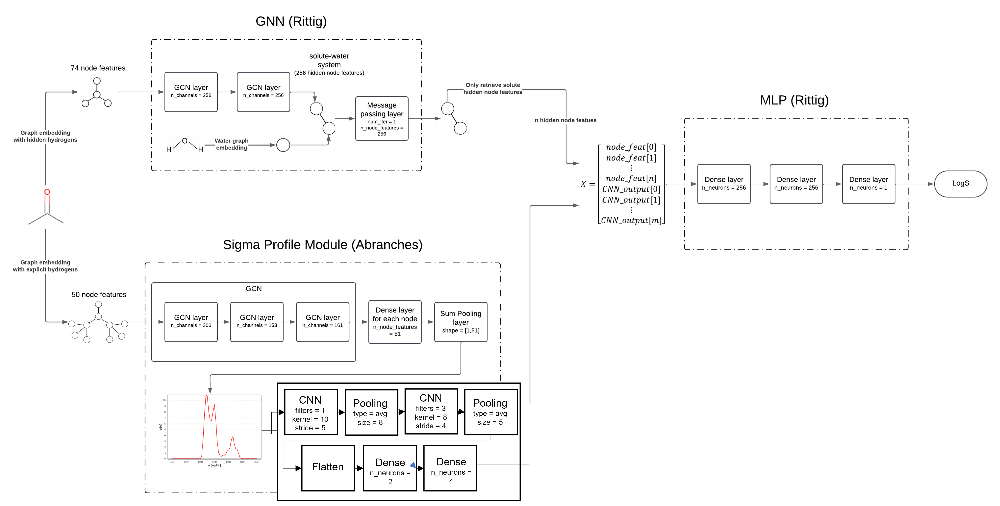
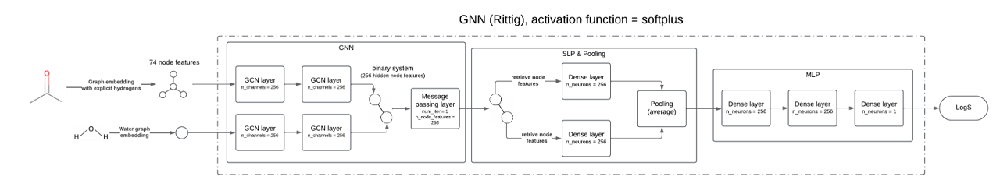
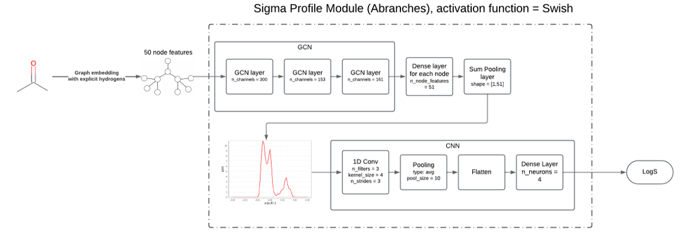
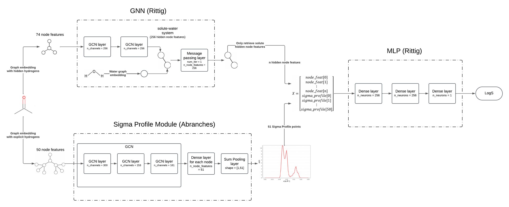
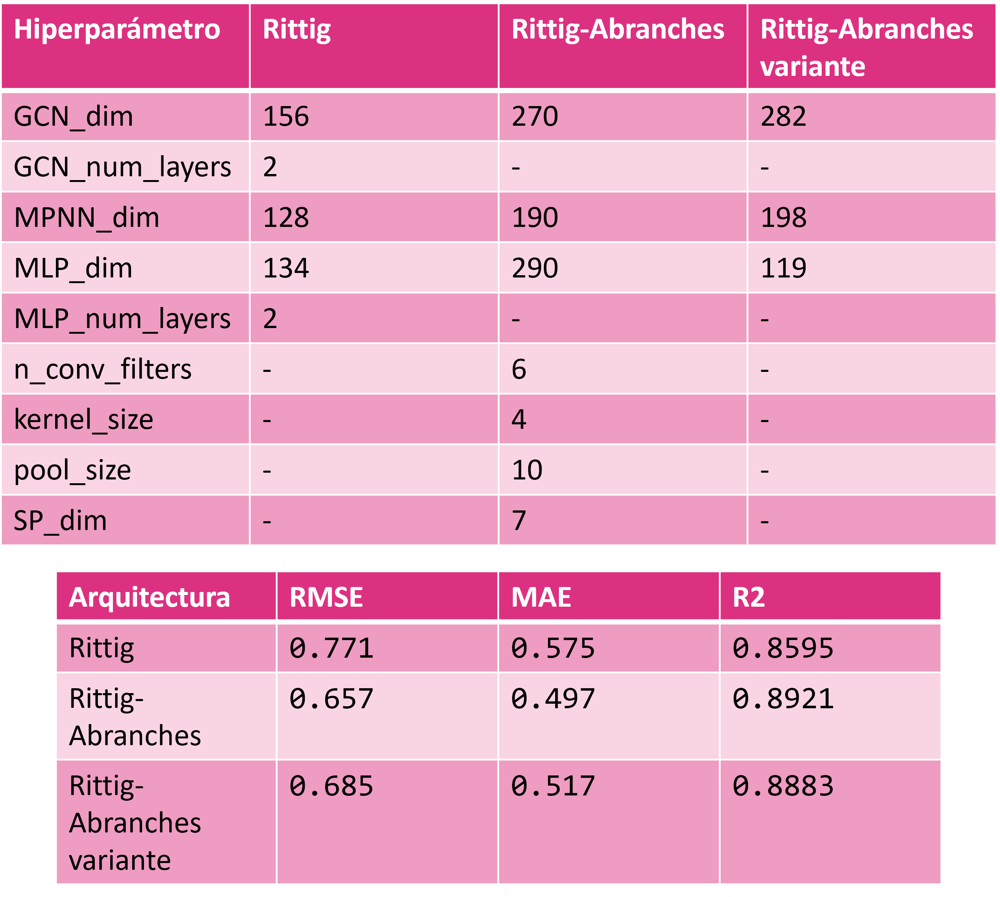

# aqueous-solubility-GNN

## Overview

This repository corresponds to one of the solubility models of the ongoing study of Kevin Vergara, Dr. Pedro Saa and Dr. Nicolás Gajardo. The present model is based on the architecture of [Qin et al., (2023)](https://pubs.rsc.org/en/content/articlelanding/2023/dd/d2dd00045h), [Rittig & Mitsos, (2024)](https://pubs.rsc.org/en/content/articlelanding/2024/sc/d4sc04554h), and [Abranches et al., (2023)](https://pubs.acs.org/doi/10.1021/acs.jctc.3c01003). The proposed architecture is the following (this image does **not** show the optimized parameters):

## Datasets
This part of the study uses five main datasets, obtained from Ali et al., 2024 (https://github.com/ComPlat/water-solubility-prediction). All dataset files are found in `data/solubility_water/`:
- **BNNlab_water_solubility_data.csv** (900 samples)
- **Gihan_water_solubility.csv** (6,154 samples)
- **Sorkun_water_solubility.csv** (9,943 samples)
- **Xian_Zeng_water_solubility.csv** (11,862 samples)
- **Huuskonen_water_solubility.csv** (1,282 Test set - samples)

The combined dataset results in a total of 28,859 datapoints.

## Preprocessing
The datasets processing was done in the notebook `merge_water_solubility_datasets.ipynb`. This included (as done in Ali et al., 2024):
- **Removing duplicates**: Ensuring that no duplicate entries exist within the combined dataset.
- **Canonical SMILES**: Generating canonical SMILES strings to identify and remove matching data points between the training and test datasets.
- **Resulting Datasets**: After preprocessing, the datasets files are:
  - Training data: **unique_train_water_final.csv** (17,737 samples)
  - Test data: **unique_test_water_final.csv** (1,282 samples)

Further processing was done, which was not done in the Ali et al. (2024) study. This was done in `compatibilize_water_solubility_with_rittig_architecture.ipynb` notebook. This includes:
- **Generating solute and solvent lists**: in order to use the datasets with the Rittig et al. (2024) based model, a generation of files containing the solute and solvent (only water) information was necessary. The files are:
  - **solute_list.csv**
  - **solvent_list_water.csv**
- **Compatibilizig the train/test datasets with the solute and solvent list**: through adding columns for solute id and solvent id. This was done in `compatibilize_water_solubility_with_rittig_architecture.ipynb` notebook. The resulting files are:
  - **COMPATIBLE_unique_train_water_final.csv**
  - **COMPATIBLE_unique_test_water_final.csv**
- **Adding polarity and molecular size information**: To apply stratified sampling based on these parameters since they are deemed important for solubility. This was done in `add_molecular_size_and_polarity.ipynb` notebook. The resulting **final** files:
  - **solute_list_with_polarity_and_size.csv**
  - **solvent_list_water_with_polarity_and_size.csv**
  - **COMPATIBLE_unique_train_water_with_hybrid_classes.csv**
  - **COMPATIBLE_unique_test_water_with_hybrid_classes.csv**
 
## Model training
The model architecture is found in `model/model_GNN_water.py` (the proposed architecture is under the class `Rittig_and_Abranches`). The 5-fold cross-validation training and evaluation was done in `train_water_solubility.py`, and the retraining of the model through the whole training dataset was done in `retrain_water_solubility_whole_dataset.py`. The model testing was done in the notebook `test_models.ipynb`.

### Architecture purely based on Rittig & Mitsos (2024) version:

### Architecture purely based on Abranches et al. (2023) version:

### Architecture based on a combination of both Rittig and Abranches:

### A simplified version of the Rittig-Abranches proposed model:

## Hyperparameter optimization
The hyperparameter optimization was done with Optuna library and through the CENIA cluster, the files are:
- **BO_RittigPure.py**
- **BO_Rittig_Abranches.py**
- **BO_Rittig_Abranches_variant.py**

The Abranches_Pure version of the model was not optimized since it showed significantly bad evaluation results. The optimization results are as presented:

## Repository structure
- `SigmaProfileModel/`:  Obtained from the Abranches et. al (2023) study [repository](https://github.com/MaginnGroup/GSP). This module generates a Sigma Profile from a given SMILES.
  
- `data/`: contains mainly the datasets used in the aqueous solubility module of the study.
  - `data/Rittig/`: contains dataset originally used in the Rittig & Mitsos (2024) study, which was focused on activity coefficient prediction and not solubility prediction.
  - `data/solubility_water/`: contains all the datasets and their processed version as stated in the "Dataset" segment of this README. Here, it is important to consider that the **final** files are:
    - **solute_list_with_polarity_and_size.csv**
    - **solvent_list_water_with_polarity_and_size.csv**
    - **COMPATIBLE_unique_train_water_with_hybrid_classes.csv**
    - **COMPATIBLE_unique_test_water_with_hybrid_classes.csv**

Additionally, in the `data/solubility_water` folder, there are 2 files not previously referenced:
  - **MORGAN_train_water_with_hybrid_classes.csv**: training dataset with Morgan fingerprint features (a Morgan fingerprint is a binary vector of variable length that gives information about structure and functional groups of the molecule).
  - **MACCS_train_water_with_hybrid_classes.csv**: training dataset with MACCS fingerprint features (a MACCS fingerprint is a binary vector of a fixed length that gives information about functional groups of the molecule).
These were made to create one of the benchmarks used to assess model performance.
 
- `doc/`: images used in this README.

- `model/`: contains the model classes used
  - `model_GNN.py`: contains model classes used for the activity coefficient module (not relevant for the present module).
  - `model_GNN_water.py`: contains model classes used for aqueous solubility prediction.

- `notebooks/`: contains the jupyter notebooks used.
  - `add_molecular_size_and_polarity.ipynb`: adds columns of molecular weight and TPSA to the solute and solvent lists datasets.
  - `compatibilize_water_solubility_with_rittig_architecture.ipynb`: adds columns of solute_id and solvent_id to training and testing datasets 
  - `merge_water_solubility_datasets.ipynb`: merges all four training datasets, adds canonical smiles and removes duplicates present in the resulting training/testing datasets.
  - `morgan_fingerprint_dataset_generator.ipynb`: adds columns of Morgan and MACCS fingerprints to training/testing datasets, which was used as one of the benchmarks to verify model performance.

- `results_BO/`: contains mainly the database files (.db) of _some_ of the Bayesian Optimization trials done.

- `results_hybrids/`: contains the model weights, training loss arrays, and validation loss arrays for the attempted hybrid GNN-XGB models that included Morgan or MACCS fingerprints.

- `results_water/`: contains the model weights, training loss arrays, validation loss arrays, training indices, and validation indices of each of the 5-fold cross validation instance for models trained. Contains also the weights of the models retrained over the whole training dataset.

- `util_water/`: contains different methods for constructing the molecular graphs and loading the training dataset.
  - **atom_feat_encoding_water.py**: collection of classes and methods that encode features for the molecular graphs.
  - **data_splitting_water.py**: methods for splitting the training/validation datasets.
  - **generate_dataset_for_training.py**: classes and methods for generating the datasets in a dataclass format, in which the molecular graphs are constructed.

- **Files for 5-fold cross validation training**:
  - **train_Rittig.py**: original file used by Rittig & Mitsos (2024) in their activity coefficient.
  - **train_water_solubility.py**: adjusted the Rittig & Mitsos (2024) file for aqueous solubility.
  - **train_water_hybrid_GNN-XGB.py**: attempted to train a hybrid GNN-XGB model, which replaced the MLP module by a XGB machine, but failed in increasing performance.
  - **train_water_XGB-Morgan_or_MACCS.py**: used to train an XGB model based on molecular fingerprint to construct one of the benchmarks to assess model performance.

- **Files for retraining with whole training dataset**:
  - **retrain_water_solubility_whole_dataset.py**: retrains aqueous solubility models over the whole dataset.
  - **retrain_water_hybrid_GNN-XGB_whole_dataset.py**: retrains hybrid GNN-XGB model over the whole dataset.
  - **retrain_water_hybrid_GNN-XGB_whole_dataset_ONLY_XGB.py**: retrains only the XGB module over the whole dataset.
  
- **Files for hyperparameter optimization**:
  - **BO_RittigPure.py**: used for optimizing purely Rittig-based architecture.
  - **BO_RittigPure_fittingparam.py**: used to fit training parameters in a second step fashion.
  - **BO_Rittig_Abranches.py**: used for optimizing hybrid Rittig-Abranches architecture (main proposed model).
  - **BO_Rittig_Abranches_fittingparam.py**: used to fit training parameters in a second step fashion.
  - **BO_Rittig_Abranches_variant.py**: used for optimizing a simplified version of the hybrid Rittig-Abranches architecture.
  - **BO_Rittig_Abranches_variant_fittingparam.py**: used to fit training parameters in a second step fashion.

- **Files for model testing**
  - **test_models.ipynb**: generic notebook to test whichever aqueous solubility or activity coefficient model.
  - **infer_Rittig.py**:  original file used by Rittig & Mitsos (2024) for testing activity coefficient models.

